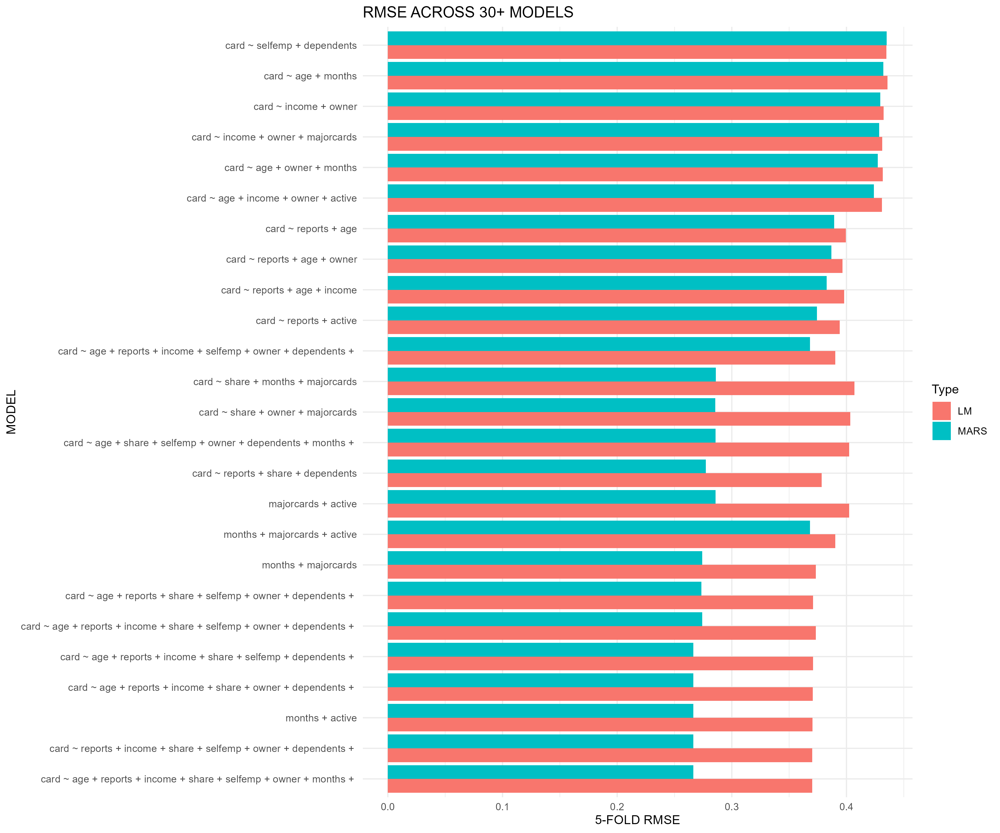
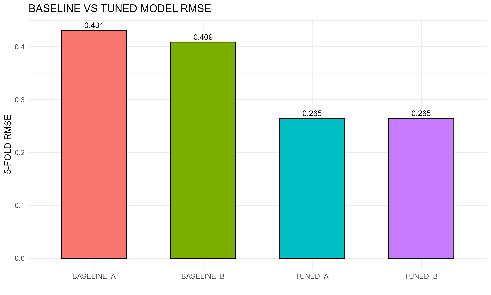

# Credit Card Approval Prediction

Machine learning project that builds and evaluates 30+ predictive models using Linear Regression and Multivariate Adaptive Regression Splines (MARS) with k-fold cross-validation to predict credit card approval decisions.

## Project Overview

This project implements a comprehensive model comparison framework for credit card approval prediction. The analysis evaluates 30 different predictor combinations using both linear regression and MARS models, resulting in 60+ total model configurations tested on a dataset of 19,786 customer records.

## Results

The tuned models achieved significant improvements over baseline models:

- **Average improvement: 36.95%** reduction in RMSE
- Baseline A to Tuned A: **38.63% improvement**
- Baseline B to Tuned B: **35.28% improvement**

### Model Comparison

The following visualization compares RMSE across all 60+ model configurations (30 formulas × 2 model types):



### Baseline vs Tuned Models

Comparison of baseline models against the tuned models:



## Methodology

### Model Types

1. **Linear Regression (LM)**: Standard linear models for baseline comparison
2. **MARS (Multivariate Adaptive Regression Splines)**: Non-linear models with interaction terms
   - Degree: 2 (allows two-way interactions)
   - Threshold: 0.001

### Cross-Validation

- 5-fold cross-validation for all models
- Random seed: 354987 (for reproducibility)
- Performance metric: RMSE (Root Mean Squared Error)

### Model Evaluation Process

1. Test 30 different predictor combinations
2. Evaluate each combination with both LM and MARS
3. Compare baseline vs. tuned models
4. Generate visualizations and performance metrics

## Files

- `credit_approval.R` - Main analysis script
- `Student Data 5.csv` - Dataset (19,786 records)
- `MyModels.Rdata` - Pre-trained tuned models
- `install_packages.R` - Helper script to install required packages
- `images/model_comparison.png` - Visualization of all model RMSE comparisons
- `images/baseline_vs_tuned.png` - Baseline vs tuned model comparison
- `images/improvement_results.csv` - Detailed improvement metrics

## Getting Started

### Prerequisites

- R (version 3.6 or higher)
- Required R packages:
  - `earth` (for MARS models)
  - `ggplot2` (for visualizations)

### Installation

1. Clone this repository:
```bash
git clone https://github.com/Awais-Website/credit-card-approval-ml-r.git
cd credit-card-approval-ml-r
```

2. Install required R packages:
```r
source("install_packages.R")
```

Or manually:
```r
install.packages(c("earth", "ggplot2"))
```

### Usage

1. Ensure `Student Data 5.csv` is in the same directory as the script
2. Run the analysis:
```r
source("credit_approval.R")
```

**Note:** The full analysis takes approximately 10-45 minutes to complete, depending on your system specifications.

## Technical Details

- **Dataset**: 19,786 customer records
- **Target Variable**: `card` (credit card approval)
- **Predictors**: age, reports, income, share, selfemp, owner, dependents, months, majorcards, active, expenditure
- **Validation**: 5-fold cross-validation
- **Performance Metric**: RMSE

## Output

The script generates:
- Console output with RMSE for all models
- `images/model_comparison.png` - Bar chart comparing RMSE across all 60+ model configurations
- `images/baseline_vs_tuned.png` - Baseline vs. tuned model comparison visualization
- `images/improvement_results.csv` - Detailed improvement metrics

## Notes

- The comparison section requires `MyModels.RData` to be present (contains pre-trained `model1A` and `model1B`)
- If the file is missing, the script will still run the main analysis and baseline models
- Runtime varies based on model complexity and system specifications
